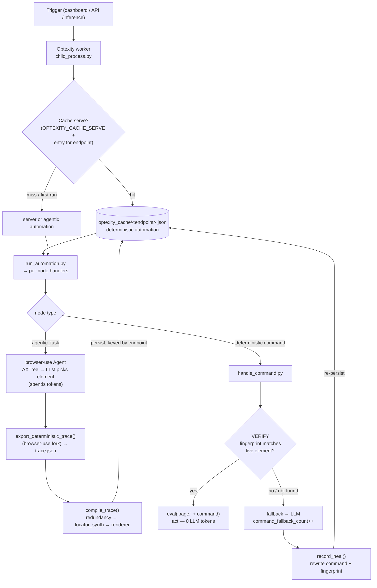

# Learning cache — agentic → deterministic, self-repairing

A memory layer for Optexity automations. The first time an objective runs, browser-use (an
LLM) figures out the steps from scratch — spending tokens and latency on **every** run, with
no memory between runs. This module captures what the agent actually did, **compiles it into
a deterministic automation** (Playwright-locator nodes), and lets subsequent runs **replay
deterministically** — skipping the LLM for the steps that are inherently deterministic, and
**self-healing** when a page changes upstream.

All behavior is **opt-in via env flags and off by default**, so the engine is unchanged
unless you enable it.

---

## The loop



The **right branch** (`H→I→J→D`) is *learning* (agentic → capture → compile → cache); the
**left branch** (`K→L→M`) is *deterministic replay* at 0 tokens, with `L→N→O` the *self-repair*
when a locator drifts.

1. **Capture** — after an agentic run, `AgentHistoryList.export_deterministic_trace()` (in the
   browser-use fork) dumps each action + the DOM element it touched (xpath / attributes /
   accessible name) to `trace.json`.
2. **Compile** — `compile_trace()` collapses exploration noise (keep last write per element,
   drop perception/retries), synthesizes a Playwright `command` per step (reusing the engine's
   own `LocatorExtraction._scored_candidates` ranking), attaches an element **fingerprint**,
   and builds a validated `Automation` (validation = proof it's runnable).
3. **Serve** — on a later run for that endpoint, the engine loads the cached deterministic
   automation and runs it instead of the server's — replaying locators at **0 LLM tokens**.
4. **Verify** — before acting on a cached locator, the live element's fingerprint must match
   the compiled one; on mismatch the engine **does not act on the wrong element** and falls
   back to the LLM.
5. **Heal** — when a stale locator falls back to the LLM, `record_heal` rewrites the node with
   the relearned locator + fingerprint, and the repaired automation is persisted. A drift costs
   one LLM fallback **once**, not on every future run.

Resilient-hybrid nodes carry **both** a deterministic `command` and the LLM
`prompt_instructions` fallback, so a wrong/stale locator self-heals instead of failing
(`handle_input.py` / `handle_command.py` try the command first, then the LLM).

---

## Files

| File | Role |
|------|------|
| `__init__.py` | `compile_trace()` / `compile_trace_file()` — trace → validated `Automation` |
| `redundancy.py` | `collapse_trace()` — drop noise, keep last write per element |
| `locator_synth.py` | element → best Playwright `command` (reuses engine's scorer) + `element_fingerprint()` |
| `renderer.py` | build + validate `InteractionAction` / `Automation` pydantic objects |
| `self_repair.py` | `CacheConfig` toggles, fingerprint verify, heal-on-fallback, per-endpoint persistence |
| `cli.py` | offline `compile` / `metrics` commands |

Engine touch-points are small guarded call-outs (no-ops when toggles are off):
`handle_command.py` (verify + fallback counter), `handle_input.py` / `handle_click.py` (heal),
`run_automation.py` (persist), `handle_agentic_task.py` (capture + seed),
`child_process.py` (serve / dev override). Schema: `ElementFingerprint` + `BaseAction.fingerprint`,
`Memory.heals`, `AutomationState.command_fallback_count`.

**browser-use fork:** one additive method, `AgentHistoryList.export_deterministic_trace()` — a
clean superset of upstream (no changes to existing methods). All browser-use version-drift
tolerance lives on the optexity side (`infra/utils.serialize_axtree`, `infra/browser.py`).

---

## Configuration (all opt-in; default off)

| Env var | Default | Effect |
|---------|---------|--------|
| `OPTEXITY_CACHE_VERIFY` | `0` | Fingerprint-verify each cached locator before acting |
| `OPTEXITY_CACHE_HEAL` | `0` | Relearn + persist locators that fall back to the LLM |
| `OPTEXITY_CACHE_SERVE` | `0` | Serve a cached automation on later runs + seed it from agentic runs |
| `OPTEXITY_CACHE_DIR` | `optexity_cache` | Directory of per-endpoint cache entries |
| `OPTEXITY_CACHE_HEAL_PATH` | _(unset)_ | Force a single shared cache file instead of per-endpoint |
| `OPTEXITY_TEST_AUTOMATION` | _(unset)_ | Dev override: run a local automation file (path, or `1`/`true` → `test_automation.json`). Unset ⇒ real automation runs |

Precedence when choosing what runs: **dev override → served cache → server automation**.

---

## Cache capacity

One entry **per endpoint**, keyed by `endpoint_name` at `OPTEXITY_CACHE_DIR/<endpoint>.json`.
Many endpoints (100s+) coexist without overwriting — capacity is disk-bound only (~KB each),
no LRU/TTL eviction (correctness comes from verify + heal, not expiry). 100 endpoints ≈ a few
hundred KB. `load_cached_automation(endpoint_name)` reads an entry back.

---

## How to run & reproduce

The deterministic automations per task and the measured token table
(e.g. roboform 25,339 → 0, OrangeHRM Buzz 99,356 → 6,900) are committed in
[`output/`](../../../output/README.md) — no setup needed.

**Compiler:**

```bash
OPTEXITY_API_KEY=local-dev DEPLOYMENT=dev pytest tests/test_cache.py tests/test_self_repair.py
```
Covers locator synthesis & precedence, redundancy collapse, schema-valid rendering, fingerprint
matching, heal-on-fallback, per-endpoint keying (100 endpoints → 100 files), the serve path, and
the `serialize_axtree` compatibility shim.

**Reproduce caching** (needs an Optexity API key, one recorded automation whose
`endpoint_name` is just a trigger handle, and a Gemini `GOOGLE_API_KEY`):

```bash
# install order matters: optexity first, browser-use fork LAST so it isn't shadowed
pip install -e ./optexity && pip install -e ./browser-use
python -c "import browser_use,os; print(os.path.realpath(browser_use.__file__))"  # must be the fork src
python -m playwright install chromium chrome && python -m patchright install chromium chrome
cp optexity/.env.example optexity/.env && export ENV_PATH=$PWD/optexity/.env       # fill in keys

# (A) AGENTIC run — serve a seed via the dev override, trigger, read tokens
OPTEXITY_TEST_AUTOMATION=test_automation.json optexity inference --host 127.0.0.1 --port 9000 &
curl -sX POST http://127.0.0.1:9000/inference -H 'Content-Type: application/json' \
  -d '{"endpoint_name":"<your-endpoint>","input_parameters":{<its params>}}'
python -m optexity.inference.cache.cli metrics --logs /tmp/optexity/<task_id>/logs   # ~25k tokens

# (B) COMPILE the captured trace → a deterministic automation
python -m optexity.inference.cache.cli compile --logs /tmp/optexity/<task_id>/logs \
  --url https://www.roboform.com/filling-test-all-fields --out output/roboform_cached.json

# (C) CACHED replay — serve the compiled file, trigger again, compare tokens
OPTEXITY_TEST_AUTOMATION=output/roboform_cached.json optexity inference --port 9000 &
curl -sX POST http://127.0.0.1:9000/inference -H 'Content-Type: application/json' \
  -d '{"endpoint_name":"<your-endpoint>","input_parameters":{<its params>}}'
python -m optexity.inference.cache.cli metrics --logs /tmp/optexity/<new_task_id>/logs  # 0 tokens
```

What runs is decided by precedence: **dev override (`OPTEXITY_TEST_AUTOMATION`) → served cache
(`OPTEXITY_CACHE_SERVE`) → real server automation**. Dynamic pages may show a few fallbacks on
replay — that's the hybrid `command`→LLM path working, not a failure.

---

## Token savings on subsequent runs

A deterministic node runs via `eval("page." + command)` — **no DOM goes to an LLM, 0 tokens**.
Tokens are spent only on (a) agentic reasoning and (b) per-step LLM fallback when a `command`
fails. So **tokens per run ∝ steps that needed the LLM**, and the cache drives that toward 0:

- **Agentic → deterministic:** pay the agent once (e.g. ~25k tokens for a form-fill), then
  replay at ~0 tokens every subsequent run.
- **Stale locator on a recorded automation:** without heal it re-pays the LLM-fallback tokens
  *every* run; with heal it falls back **once**, is rewritten, then 0 tokens after.

`OPTEXITY_CACHE_SERVE` is what realizes the saving — without it the cache is written but never
read back, so deterministic replay never happens.
